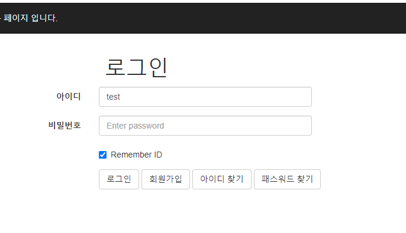
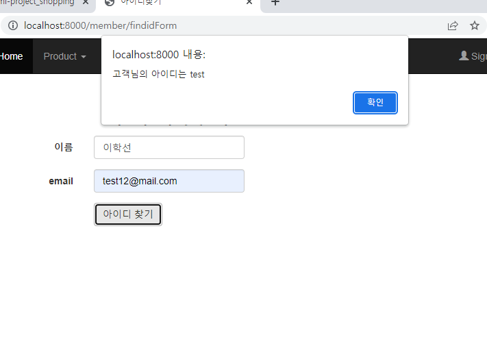
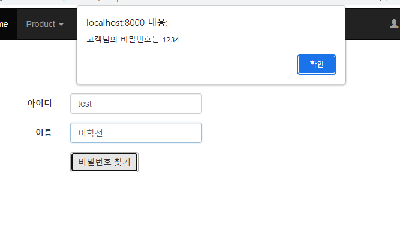
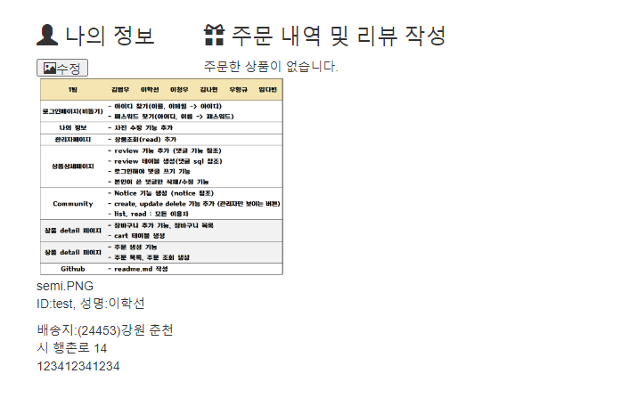
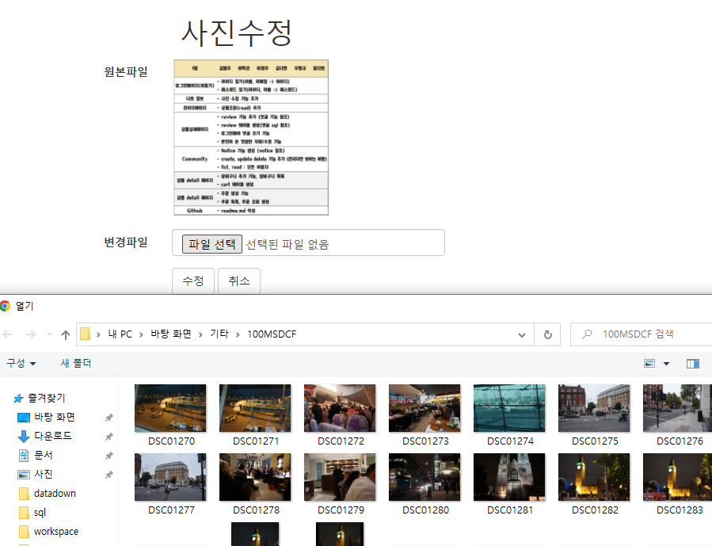
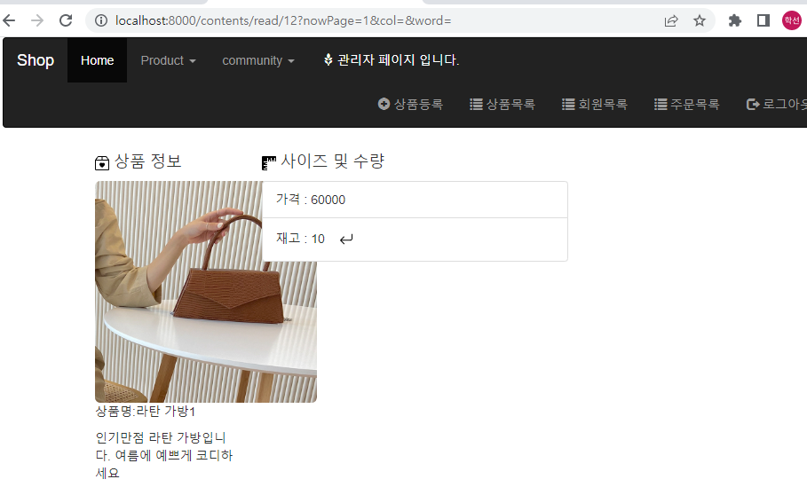
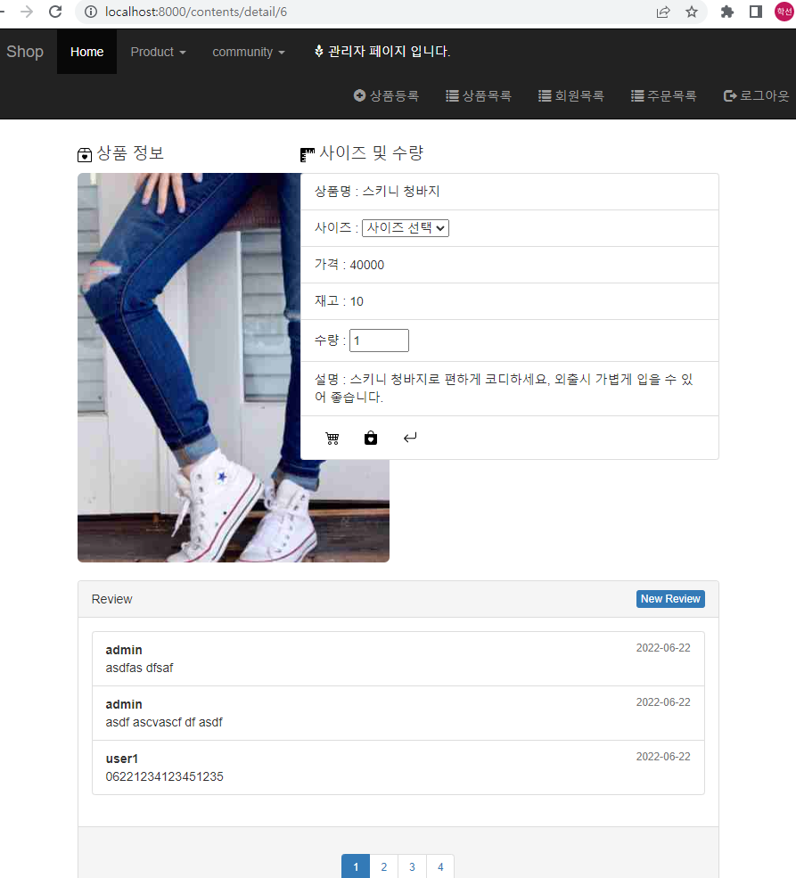
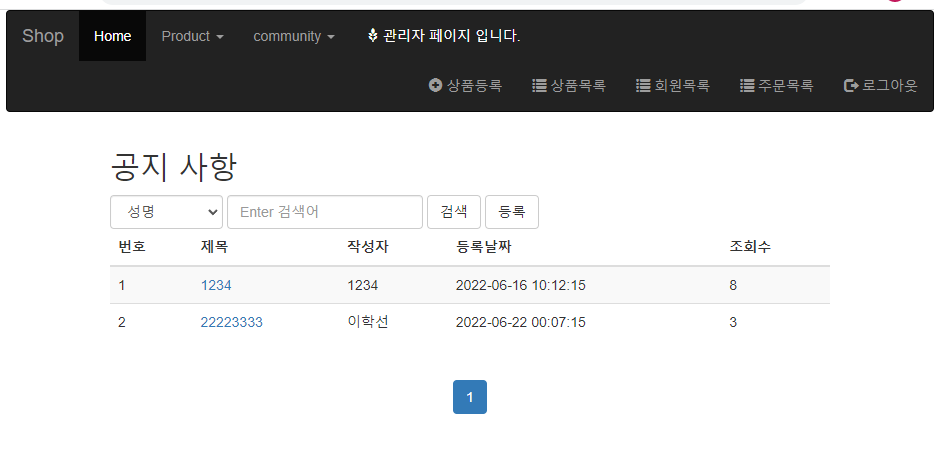
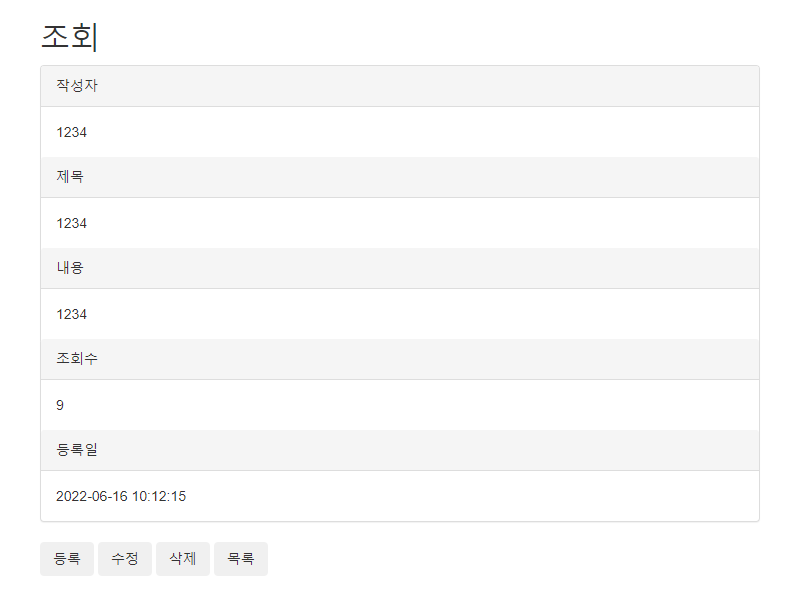

# 세미프로젝트

> 프로젝트 기간: 22. 6. 20. ~ 22. 6. 22. 

## 주제 및 내용

> 쇼핑몰 구현

 	1. 로그인
 	 - 아이디 찾기
 	 - 비밀번호 찾기

 	2. 마이페이지
 	 - 사진수정 기능 추가

 	3. 관리자페이지
 	 - 상품 조회 추가

 	4. 상세페이지
 	 - 댓글 기능 추가

 	5. 공지사항 기능 생성
 	 - 생성, 수정, 삭제 => 관리자만 가능
 	 - 목록, 조회 => 모두

### 1. 로그인

> 아이디, 비밀번호 찾기 추가

### 2. 마이페이지

> 사진수정 기능 추가

### 3. 관리자 페이지

> 상품조회 추가

### 4. 상품상세페이지 댓글 추가

### 공지사항 기능 생성

> Notice 기능 생성

